# Cross-machine task handoff — move a cezar workspace between machines

> Slug: `cross-machine-task-handoff` · Status: DRAFT · Depends on: 003 (handoff CLI), 007 (handoff journal), 2026-07-20-multi-project-workspace, 2026-07-29-agent-profiles, 2026-07-16-server-installer
> Closes gaps recorded as out of scope in `.ai/specs/003-handoff-cli.md:52` (*Handoff między maszynami*) and `.ai/specs/2026-07-20-multi-project-workspace.md:629` (*cross-machine sync*).
> Decisions settled with the owner: journal-only continuity · SSH transport · origin marked handed-off · whole-project migration as the primary flow · destination project must be registered · CLI first, cockpit later.

## 📝 TLDR

A task finished on a developer laptop cannot be continued on a cezar server (or vice versa). The
run record, its event log, its handoff journal and its git branch are all plain files cezar owns —
but nothing moves them between machines, and the agent CLI's session store is keyed by
`(account, worktree path, session id)`, so a naive copy does not resume.

Proposed future behavior: `cez handoff export` packs every finished task of one project into a
portable bundle, and `cez handoff import` on another machine recreates the worktrees from the
bundled branches, re-inserts the runs, and lets the user continue them **from the per-task handoff
journal**. Transfer is over SSH: no new port, HTTP endpoint, token or daemon. Native CLI sessions
and credentials are never transferred. A running, mid-turn task is not exportable — it must be
stopped and finished first.

## 📝 Problem Statement

cezar is sold as "easy to set up on a VPS, so your agents keep working when your laptop is
closed" (`README.md`), and `server-install` makes that box reachable. The missing half is that work
already done on the laptop cannot be moved to that server: the only paths today are to start fresh
on the server or abandon the local history. The gap is explicit in the design record —
`003-handoff-cli.md:52` lists machine-to-machine handoff as out of scope, and
`2026-07-20-multi-project-workspace.md:629` deliberately skips cross-machine sync.

The motivating case is bulk: a developer did a lot of work locally and wants the finished work and
the cockpit history on the server in one move.

What exists today and is reused:

- `recover()` (`packages/cezar/src/workflows/run.ts:1555`) already turns a `running` run left by a
  dead process into an interrupted run and calls `continueRun()`.
- The per-task handoff journal (`packages/cezar/src/handoff.ts`, spec 007):
  `.ai/cezar/runs/<id>.handoff.md` holds Goal / Progress log / Resume notes, survives worktree
  removal, and `RESTART_CONTINUATION_PROMPT` (`run.ts:840`) already tells the agent to read it
  before continuing.
- `createWorktree` (`packages/cezar/src/git-worktree.ts:136`) is idempotent and reattaches a
  surviving `cez/<id8>` branch after its directory is gone; `rematerializeReclaimedWorktree`
  (`packages/cezar/src/runs/retention.ts:68`) is the existing caller.
- The run record carries `runner`, `agentProfile`, `branch`, `baseBranch`, `worktreePath`
  (`packages/cezar/src/runs/store.ts:112-303`); each **step** carries `sessionId`, `backend` and
  `profileId` (`store.ts:83-93`). This distinction is load-bearing for the design below.

What is missing is the transport, the worktree/branch reconciliation, the origin-run lifecycle,
and a continuation path that does not depend on a vendor session file.

## 📝 Proposed Solution

One capability, two halves, one hard rule: **never transfer vendor session files or credentials.**

1. **Export** (source): write a bundle — a manifest, the run records, their NDJSON event logs, their
   handoff journals, and a `git bundle` of every referenced `cez/*` branch. After a durable write,
   mark each exported run `handoff: { direction: 'out', at, peer? }`.
2. **Transfer**: over SSH, with `scp`/`rsync` or a `tar | ssh` stream. Cezar opens no socket.
3. **Import** (destination, service stopped): validate the manifest and every record, fetch the
   bundled branches, reattach each worktree through `createWorktree`, and upsert the records with
   the destination's own `worktreePath`. Import marks each run `handoff: { direction: 'in', … }`,
   clears the dead step `sessionId`s, and strips every auto-resume field, so nothing launches on
   boot.
4. **Continuation** (destination): Continue on an imported run starts a **fresh backend session
   seeded by the journal** (the handoff contract is always-on). This is the mechanism that makes
   continuity backend-agnostic, including OpenCode, whose runner never resumes a server-side
   session (`opencode-server-runner.ts:62`).

Export is limited to terminal statuses — `done`, `failed`, `cancelled`, `review`. `queued`,
`running` and `waiting` are refused with a named message, because each holds a live or open
session that cannot travel; the user finishes or stops them first. This removes the entire class of
"imported live run starts itself" failures rather than papering over it.

Alternatives rejected: an HTTP endpoint pair on the existing authenticated front (grows the API
surface and still needs the proxy's auth); native Claude session transfer (depends on undocumented
CLI internals and a cwd-derived key, and is unnecessary for moving finished work).

## 📝 Architecture

New module `packages/cezar/src/transfer/`, deliberately **not** `handoff.ts` — that name is taken
by the per-task journal (spec 007) and the two must not be confused.

```
packages/cezar/src/transfer/
  manifest.ts   # zod schema for the bundle manifest (the cross-machine boundary)
  bundle.ts     # tar read/write, file layout, git bundle create/fetch
  export.ts     # select runs, write the bundle, mark handed-off after the write
  import.ts     # validate, fetch branches, reattach worktrees, upsert records
  ssh.ts        # the SSH runner seam (injected; no new CEZ_* var)
  cli.ts        # runHandoffCommand() — `cez handoff …`
```



```mermaid
flowchart LR
  subgraph laptop["source machine (laptop)"]
    A[RunStore + runs/ + worktrees] -->|export| B[bundle .tgz]
    B -.->|after durable write| A
  end
  B -->|scp / rsync / tar &#124; ssh| C[bundle on server]
  subgraph vps["destination machine (VPS, service stopped)"]
    C -->|import| D[git fetch cez/* from bundle]
    D --> E[createWorktree reattach]
    E --> F[RunStore.importRun + handoff.direction=in]
    F -->|service start| G[Continue = fresh session seeded by journal]
  end
```

Takeaway: the only new components are the bundle codec, the SSH seam, and one continuation branch;
branch reattachment and the journal are existing primitives reused unchanged. No new HTTP route,
port, daemon or token.

CLI routing follows the existing precedent: `cez task` and `cez automation` are dispatched before
`parseArgs` because they own their flags (`packages/cezar/src/index.ts:87-96`). `cez handoff` does
the same.

## 📝 Data Model

**Run record** — one additive, optional field on `RunRecord` (`packages/cezar/src/runs/store.ts`):

```
handoff?: {
  direction: 'out' | 'in',
  at: string,          // ISO timestamp of the export/import
  peer?: string,       // optional host label; never a credential
}
```

- `direction: 'out'` (source) blocks local Continue — the work belongs to the other machine now.
- `direction: 'in'` (destination) marks an imported run whose Continue starts a fresh session
  seeded by the journal.

One object rather than four flat fields, and additive/optional so pre-existing `runs.json` files
parse unchanged; no migration. Because `RunRecord` is served by existing routes, the same field
must be added to the mirrored `runRecordSchema` in `packages/contract/src/runs.ts:139`, and to the
slim `runIndexEntrySchema` (`contract/src/runs.ts:335`) if the global-tasks badge is wanted —
`contract-parity*.test.ts` asserts both directions.

**Bundle manifest** (`transfer/manifest.ts`, zod, the untrusted cross-machine boundary):

```
{
  formatVersion: 1,
  createdAt: string,          // ISO
  cezarVersion: string,
  sourceProjectId?: string,   // informational; the destination re-registers by path
  runs: Array<{
    id, title, status, runner?, model?, modelIdentity?, agentProfile?,
    branch?, baseBranch?, worktreePath?   // source path, informational only
  }>,
  branches: string[]          // refs packed into the git bundle, e.g. ["cez/1a2b3c4d"]
}
```

The manifest carries **references**, never secrets: no `.env`, no `~/.cezar/agent-accounts.json`,
no session files. Event NDJSON is already redacted at persist time (`core/secret-redaction.ts`).

Import clears, per imported record: every step `sessionId` (dead on the destination), and
`autoResumeAt`, `autoResumeAttempts`, `monitoringWakeAt`, `activity`, `askParked`. Without this,
`recover()` re-arms a usage-limit resume from a stale `autoResumeAt` on a `failed` record and
launches an agent at boot (`run.ts:1665` → `fireAutoResume`, guard at `run.ts:2281`;
`reconcileLoadedRun` deliberately keeps the field on `failed` runs, `store.ts:667`).

## 📝 API Contracts (CLI)

No HTTP surface changes in this feature. New commands, routed before `parseArgs`:

```
cez handoff export [<runId> | --all] [--out <file>]
cez handoff import <bundle> [--repo <path>] [--dry-run]
cez handoff push   --to <[user@]host> [--repo <path>] [--all | <runId>]
cez handoff unmark <runId> | --all
```

- `export` default output is under the existing cache root (`~/.cache/cez/handoff/`) so no
  gitignored file lands in the repo; `--out -` streams to stdout.
- `export` accepts only terminal runs (`done`, `failed`, `cancelled`, `review`); it refuses
  `queued`/`running`/`waiting` and names them. `--all` means every eligible run **in this project**
  (multi-project migration is deferred; see Phasing).
- `import` requires the destination project to be registered: it resolves the project by
  `--repo`/cwd and refuses with a named error if absent — no implicit clone.
- `import --dry-run` validates the manifest and every record and prints the planned worktree/record
  changes.
- `push` is the only command that touches the network. It does **not** stop or start the remote
  service silently: like `server-install`, it prints the exact `systemctl` commands and asks.

## 📝 UI/UX

CLI-first; the cockpit surface is Phase 3.

- Task header action **"Hand off"**, disabled for non-terminal runs with the reason.
- A **handed-off badge** on the task and in the global tasks list, driven by `handoff`.
- An **import** surface (drop a bundle) showing the manifest summary before committing — the same
  preview `--dry-run` prints.
- Accessibility and mobile reuse the existing action-menu and toast patterns; no new interaction
  primitive.

## 📝 Edge Cases & Failure Scenarios

- **Nothing auto-launches on the destination.** Import accepts only terminal records, clears every
  auto-resume/monitoring field, and clears step session ids. A test boots the destination after an
  import and asserts no runner was constructed.
- **Continuity without a session file.** Continue on an imported run starts a fresh session with
  `CEZ_HANDOFF_FILE` pointing at the journal and the always-on handoff contract. It never claims to
  have resumed a conversation it did not.
- **Source restart after export.** `recover()` skips `handoff.direction === 'out'` runs, and
  non-terminal runs are never exported, so a handed-off run cannot resume itself on the source.
- **Destination service running.** The `RunStore` holds records in memory and rewrites `runs.json`
  on its next debounced save, so import must detect a live instance (a loopback health probe, or a
  lock file) and refuse with the stop/start commands.
- **`systemctl --user` over SSH.** A non-login SSH session has no D-Bus user session
  (`ubuntu-vps.ts:246`); the stop/start guidance offers the system unit (`sudo systemctl`) or a
  login shell. `push` never escalates silently.
- **Unknown SSH host key.** Fail with SSH's own message; never add
  `-o StrictHostKeyChecking=no`.
- **Missing account on the destination.** A run whose `agentProfile` has no matching profile
  imports with a warning; Continue refuses for that run until the account exists.
- **Branch absent from the bundle.** The record imports without a worktree (diff unavailable);
  `--dry-run` reports it before anything is written.
- **Interrupted transfer.** `rsync` resumes; import upserts by run id, so re-running is idempotent.
- **Missing `ssh`/`git`.** Degrade with a named error; `import` from a local file needs no SSH.

## 📝 Risks & Impact Review

- **Run-record field.** One additive optional object; the contract mirror must change in the same
  commit or `contract-parity` fails. No migration.
- **New CLI command.** Additive to the public CLI surface, which is
  `BACKWARD_COMPATIBILITY.md` **§1** — the command must be added to that inventory in the same PR.
  Removing or renaming it later is a breaking change.
- **`handoff.direction: 'out'` blocks Continue** on the source — reversible by
  `cez handoff unmark`, so the state change has an undo path. The mark is written only after a
  durable bundle write, and the block message names the unmark command.
- **Continuation behavior change.** Continue gains one branch (no session id + `direction: 'in'` →
  fresh session). The existing `'no agent session to resume'` refusal is unchanged for every other
  run; a regression test pins that.
- **No new `CEZ_*` variable**, so no `.env.example` change: SSH is invoked through an injected
  runner seam (the `RunProviderCommand` precedent in `provider-auth.ts:39`), not an env override.
- **No new `.ai/cezar/` file**, so `ensureDataGitignore` is untouched — the bundle defaults outside
  the repo. Stated explicitly because AGENTS.md flags this as a recurring miss.
- **Zero-config posture.** Nothing runs in the background; the network is touched only by an
  explicit `push` with a host argument. The opt-in is the invocation itself — the default path
  opens no socket.
- **Security.** Bundle is secrets-free; event logs are redacted at persist time. The `[user@]host`
  is validated against a strict pattern (no shell metacharacters) and passed to `spawn` as an argv
  array, never a shell string; git refs keep using `isSafeGitRef`.

## 📋 Phasing

- **Phase 1 — bundle and file migration.** Export/import of cezar-owned files, worktree reattach,
  history and diffs visible on the destination. No continuation yet.
- **Phase 2 — continuity and origin lifecycle.** `handoff` field, Continue-blocks-on-out, Continue
  starts fresh from the journal on `in`, `unmark`.
- **Phase 3 — SSH convenience and cockpit.** `cez handoff push`, the "Hand off" action, badge,
  import surface.
- **Deferred.** Multi-project (whole-workspace) migration; native Claude session transfer.

`cez handoff push` (Phase 3) is the one network-touching layer and is additive on top of a
fully-working file-based migration. If review prefers, it can be split into its own spec so the
network surface gets a separate security review; keeping it here is a convenience, not a
dependency.

## 📋 Implementation Plan

**Phase 1**
1. `transfer/manifest.ts` + `transfer/bundle.ts` — zod manifest and tar layout; round-trip test on a temp dir.
2. Add `handoff?` to `RunRecord` and the contract mirrors (`runRecordSchema`, `runIndexEntrySchema`); parity test.
3. Add `RunStore.importRun(record)` — insert/replace by existing id, validating against `runRecordSchema` first, routed through the same save scheduling and `run` emission as `createRun` (never a direct `runs.json` write). Unit test, including a malformed record that must not poison the array.
4. `transfer/export.ts` + `cez handoff export`: terminal-run selection, NDJSON/journal collection, `git bundle create`, `--out`, refusal rules, and the post-write mark. Tests for selection, refusals, and "no mark on a failed write".
5. `transfer/import.ts` + `cez handoff import`: manifest and per-record validation, registered-project check, live-instance probe, `git fetch` from bundle, `createWorktree` reattach, record normalization (clear step session ids and auto-resume/monitoring fields, set `handoff.direction: 'in'`), destination `worktreePath`, `--dry-run`. Integration test: export a fixture workspace, import into a second temp repo, assert records, worktrees, statuses, and that booting the destination constructs no runner.
6. Docs: `docs/reference.md`, `HELP`, and the `BACKWARD_COMPATIBILITY.md` §1 CLI inventory.

**Phase 2**
7. `recover()` skips `handoff.direction === 'out'`; Continue refuses on `'out'` with the unmark hint; `cez handoff unmark <runId>|--all`. Tests, including the unchanged refusal for a run with neither flag.
8. Continue on an imported run (`direction: 'in'`, no step session id) starts a fresh session seeded by the journal. Test with the mock runner asserting the journal is attached and no native resume is attempted.

**Phase 3**
9. `transfer/ssh.ts` + `cez handoff push`: injected runner, strict `[user@]host` validation, argv-not-shell invocation, no host-key override, printed (not silent) service commands. Tests with a fake runner.
10. Cockpit: "Hand off" action, handed-off badge, import surface. Unit tests + one e2e flow.
